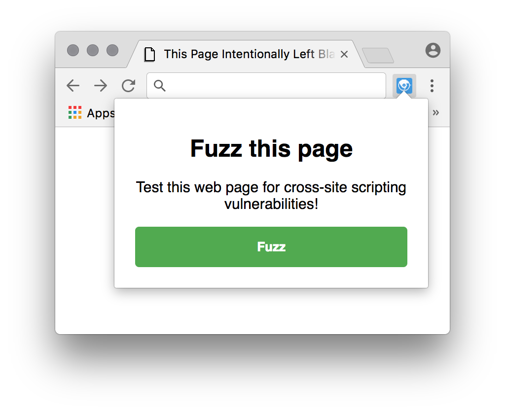

# XSS Hamster
XSS Hamster is a tool that detects parameters and fuzzes them for cross-site scripting vulnerabilities.

## Installation instructions.
1. Go to `chrome://extensions/`
2. Enable developers mode.
3. `git clone https://github.com/bugbountyforum/XSS-Hamster`
4. Press on `load unpacked extension..`
5. Open the `extension` folder.

## How to use.

Click on the icon and press on "Fuzz"!

### Who made this?
This tool is a bug bounty forum project with the following contributors:
- Ibram Marzouk
- Anshuman Bhartiya
- Rafal Janicki
- Jack Cable
- Filipe Reis
- gradius
- Olivier beg

### Will there be support for Firefox too?
Probably yes, we decided to start with Google Chrome because it's nowadays more used.
